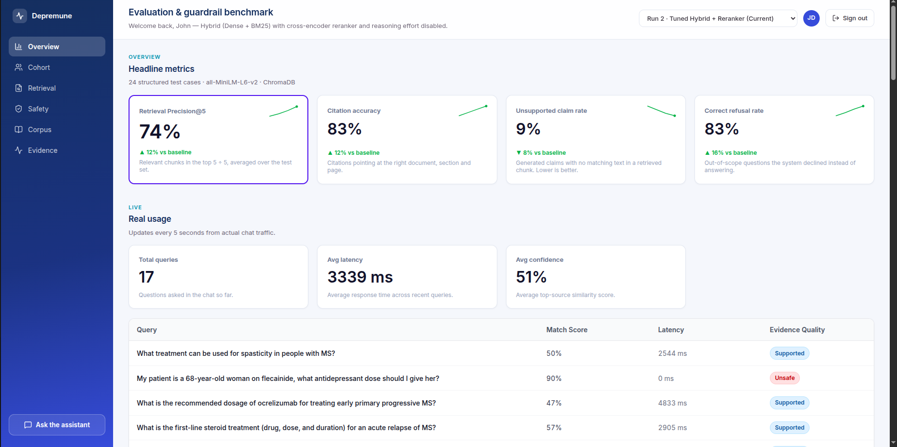

# Full-Stack Hackathon Project: Medical Healthcare Authentication System

A complete full-stack web application featuring a modern React frontend and a secure Python Flask backend for user authentication (Sign Up, Login, and Password Reset) with JWT support and SQLite data persistence.

---

## 🎥 System Walkthrough & Demo Video

Watch the full end-to-end system demonstration covering authentication, the clinical RAG assistant, real-time telemetry logging, and the benchmark dashboard:

* **Watch on Google Drive:** [▶️ Open Depremune Demo Video](https://drive.google.com/file/d/1ge6xFHLofWMrVzg5VPyOLOI6QskYtqqw/view?usp=sharing)

> *Note: If watching locally, the recording is located at `demoVideo/Depremune Demo.mp4`.*

---


## 📸 Application Previews & Workflows

### 1. User Authentication Flow

| Sign Up Page | Login Portal |
| :---: | :---: |
|  |  |

---

### 2. State & Access Verification

| Account Created (Sign-Up Success) | Clinical Workspace Access Granted |
| :---: | :---: |
|  |  |

---

### 3. Clinical Intelligence & Analytics

| Evaluation & Benchmark Dashboard | Real-Time AI Research Chat |
| :---: | :---: |
|  |  |

---

## 🛠️ Tech Stack

* **Frontend:** React, Vite, Tailwind CSS, Framer Motion, Lucide Icons
* **Backend:** Python, Flask, Flask-CORS, Flask-SQLAlchemy, Flask-JWT-Extended, Werkzeug Security
* **Database:** SQLite

---

## 📁 Project Structure

```text
Full-Stack-Hackathon/
├── FrontEnd/
│   ├── src/
│   │   ├── components/        # Shared UI components (AuthCard, buttons, layout)
│   │   ├── features/
│   │   │   ├── auth/          # Signup, login, and validation workflows
│   │   │   └── dashboard/     # Benchmark metrics, cohort charts & telemetry
│   │   ├── pages/             # View pages (SignUpPage, DashboardPage, Chat)
│   │   ├── App.jsx            # Main app router & state manager
│   │   └── main.jsx           # React DOM root entry
│   ├── package.json
│   └── vite.config.js
├── backend/
│   ├── app.py                 # REST API endpoints & live telemetry aggregator
│   ├── rag.py                 # RAG pipeline, guardrails & Groq LLM integration
│   ├── models.py              # SQLAlchemy database models (User & QueryLog)
│   ├── requirements.txt       # Python dependency specifications
│   └── instance/              # Auto-generated SQLite database (app.db)
├── screenshots/               # UI preview images for documentation
└── demoVideo/                 # Project walkthrough video recording
```

---

## 🚀 Getting Started & Local Setup
1. Clone and Navigate

```
git clone [https://github.com/Ghonem23/Full-Stack-Hackathon.git](https://github.com/Ghonem23/Full-Stack-Hackathon.git)
cd Full-Stack-Hackathon
```
2. Set Up and Run the Flask Backend

```
cd backend
python3 -m venv venv
source venv/bin/activate
pip install -r requirements.txt
python app.py
```
3. Run the Frontend Application

```
cd FrontEnd
npm install
npm run dev
```
---

## 🔌 API Endpoints Contract

```
# 1. User Sign Up
# Creates a new user in the SQLite database and returns the created user object.
curl -X POST [http://127.0.0.1:5000/api/auth/signup](http://127.0.0.1:5000/api/auth/signup) \
  -H "Content-Type: application/json" \
  -d '{
    "fullName": " John Doe",
    "email": "John@example.com",
    "password": "Password123"
  }'

# 2. User Login
# Authenticates user credentials, validates password hash, and returns a JWT access token.
curl -X POST [http://127.0.0.1:5000/api/auth/login](http://127.0.0.1:5000/api/auth/login) \
  -H "Content-Type: application/json" \
  -d '{
    "email": "John@example.com",
    "password": "Password123",
    "remember": true
  }'

# 3. Forgot Password
# Accepts email and initiates a password reset flow.
curl -X POST [http://127.0.0.1:5000/api/auth/forgot-password](http://127.0.0.1:5000/api/auth/forgot-password) \
  -H "Content-Type: application/json" \
  -d '{
    "email": "John@example.com"
  }'
```
